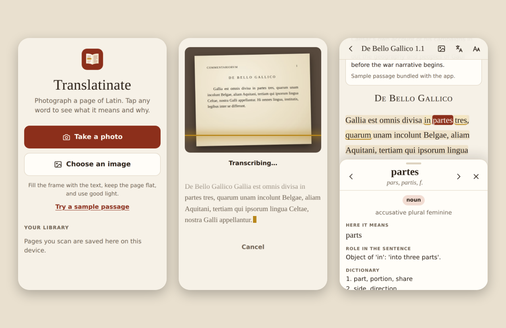

# Translatinate

Photograph a page of Latin on your phone and read it in a clean, tappable
format. Tap any word to see it highlighted along with its dictionary entry,
full grammatical parse, what it means in this sentence, its role in the
sentence, and the words it is grammatically tied to. It works on classical,
medieval and early-modern texts, printed or handwritten.



## How it works

1. **Take a photo.** The browser shrinks it to at most 2576 px on the long
   edge (the most Claude can use) and sends it to the server.
2. **Transcribe.** The server sends the photo to Claude, which returns the
   Latin text split into headings, paragraphs and verse, one sentence at a
   time, with an English translation of each sentence and a note about the
   passage. It normalizes long s and expands scribal abbreviations. The text
   appears on your phone as it is transcribed.
3. **Read.** The text is shown as clean, reflowed type (verse keeps its
   lines). In the background, each sentence goes back to Claude for
   word-by-word analysis. The sentence you tap jumps to the front of the queue.
4. **Tap a word.** A sheet slides up with the lemma and principal parts, part
   of speech, parse, meaning here, role in the sentence, dictionary senses,
   English derivatives and a learner's note. Below that are the whole sentence
   with its translation, a literal word-for-word version, and a note on how
   the sentence is built. The rest of the sentence is shaded, and the words
   tied to the one you tapped are underlined in gold. Use the ‹ › buttons (or
   the arrow keys) to step through the words.

Everything you scan is saved in your phone's browser storage (IndexedDB),
including the photo and every analysis already fetched. Reopening a page
costs nothing.

Other controls in the reader: show the original photo (tap it to zoom), show
the translation under each paragraph, and change the text size.

## Running it

You need [Node.js](https://nodejs.org/) 20.12 or newer and a Claude API key
from the [Anthropic Console](https://console.anthropic.com/).

```bash
npm install
cp .env.example .env      # then put your key in ANTHROPIC_API_KEY
npm run dev
```

The server prints the addresses it is listening on, for example:

```
Translatinate listening on http://localhost:3000
  on your phone (same Wi-Fi): http://192.168.1.23:3000
```

Open the second address on your phone. Photo capture works over plain HTTP,
so you don't need a certificate for this.

### Using an OpenRouter key instead of Claude

The app can also run on any image-reading model on
[OpenRouter](https://openrouter.ai), with a key from
[openrouter.ai/keys](https://openrouter.ai/keys). Put these in `.env` in place
of the Claude key:

```bash
OPENROUTER_API_KEY=sk-or-...
OPENROUTER_MODEL=google/gemini-2.5-flash   # optional; any model that accepts images
```

When only the OpenRouter key is set, the server uses it automatically. When
both keys are set, Claude wins unless you add `AI_PROVIDER=openrouter`. The
startup log says which one it's using. To find other models, filter
[openrouter.ai/models](https://openrouter.ai/models) by image input. Models
whose id ends in `:free` cost nothing but are rate-limited, and smaller models
read old print and parse Latin noticeably less well. If a model returns
malformed answers, the app says so and suggests trying another.

**Try it without an API key:** tap **Try a sample passage** on the home
screen, or start the server with `MOCK_CLAUDE=1 npm run dev`. In mock mode
every upload returns the bundled Caesar sample, which lets you test the whole
photo → transcription → reader flow for free.

### Deploying so it works anywhere

Any host that runs Node works (Render, Railway, Fly.io, a VPS, …):

- Build command: `npm install && npm run build`
- Start command: `npm start`
- Environment: `ANTHROPIC_API_KEY`, and **`APP_PASSCODE`**. With a
  passcode set, the app asks for it once per device before calling Claude.
  Without one, anyone who finds the URL can spend your API credits.

Once it is served over HTTPS, use **Add to Home Screen** (Safari's Share menu,
or Chrome's ⋮ menu) and it opens full-screen like a native app.

## Configuration

| Variable | Default | Purpose |
|---|---|---|
| `ANTHROPIC_API_KEY` | (none) | Your Claude API key. Required unless `MOCK_CLAUDE=1`. |
| `APP_PASSCODE` | (none) | If set, the phone must enter this before the server calls Claude. |
| `ANTHROPIC_MODEL` | `claude-opus-5-5` | Claude model used for both steps. |
| `TRANSCRIBE_EFFORT` | `medium` | `low` … `max`: how hard Claude works on reading the page. Raise it for difficult manuscripts. |
| `ANALYZE_EFFORT` | `medium` | Same, for the per-word analysis. `low` is faster and cheaper. |
| `OPENROUTER_API_KEY` | (none) | Use OpenRouter instead of Claude (see above). |
| `OPENROUTER_MODEL` | `google/gemini-2.5-flash` | OpenRouter model id; must accept images. |
| `OPENROUTER_MAX_TOKENS` | `16000` | Output limit per OpenRouter request. |
| `AI_PROVIDER` | automatic | `anthropic` or `openrouter`, to choose when both keys are set. |
| `MOCK_CLAUDE` | off | `1` serves the bundled sample instead of calling any AI. |
| `PORT` / `HOST` | `3000` / `0.0.0.0` | Where the server listens. |

**Cost.** Most of the cost is Claude's output, and most of the output is the
word-by-word analysis, roughly 100 tokens per word. A rough estimate from
token counts (not measured) is about 10 cents for the transcription plus
around half a cent per word analyzed, so a dense page of 300 words costs
somewhere around $1.50. Setting `ANALYZE_EFFORT=low` reduces this. Pages you
reopen from the library cost nothing.

**Refusals.** Requests use the API's server-side fallback
(`fallbacks: "default"`). If a safety classifier wrongly declines a request,
the API reruns it on a recommended fallback model within the same call. If
every model declines, the app shows an error.

## Project layout

```
src/
  server.ts    Express server: static files, /api/transcribe, /api/analyze,
               optional passcode, NDJSON streaming with keep-alives
  claude.ts    The two Claude calls (streaming + structured JSON output)
  prompts.ts   System prompts for transcription and word analysis
  schemas.ts   Zod schemas for Claude's output and for request bodies
  openrouter.ts  The same two calls through OpenRouter (optional provider)
  mock.ts      MOCK_CLAUDE=1 stand-in that serves the bundled sample
  env.ts       Loads .env before anything reads settings
public/
  index.html, styles.css, manifest.webmanifest, icons/
  js/app.js       Routing, photo → transcription flow, library
  js/reader.js    Tappable text, word sheet, background analysis queue
  js/tokenize.js  Word splitting shared by the display and the analysis request
  js/image.js     Resizing/compressing photos in the browser
  js/store.js     IndexedDB library
  js/api.js       Server calls, streaming response reader, passcode
  sample/         Bundled Caesar passage (photo + full analysis)
test/             Unit tests (npm test)
```

The frontend is plain ES modules with no build step. To change the UI, edit
the files in `public/` and reload.

```bash
npm test          # unit tests
npm run typecheck # TypeScript check of the server
```

## Privacy

Photos are sent to your server and from there to the Claude API. Your library
never leaves the phone; it lives in that browser's storage, so clearing site
data deletes it.
